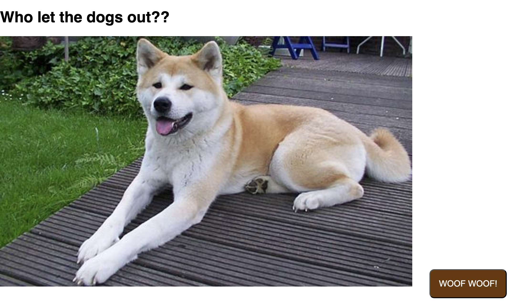

# React Simple Data Fetching Lab

React application that demonstrates how to fetch and display random dog images using the Dog CEO API. Built with Vite and React Hooks, it illustrates asynchronous data fetching, state management, and conditional rendering for loading and error states.

---

## Table of Contents

- [Demo](#demo)
- [Prerequisites](#prerequisites)
- [Installation](#installation)
- [Testing](#testing)

---

## Demo

1. On load, the app fetches a random dog image and displays a loading indicator.  
2. Click the **Woof Woof** button to fetch a new image.

---

## Prerequisites

- Node.js v14 or higher  
- npm (comes with Node.js)

---

## Installation

1. Clone the repo
2. `npm install`
3. `npm run dev` 
4. Follow link to view site

## Testing
run `npm test`
